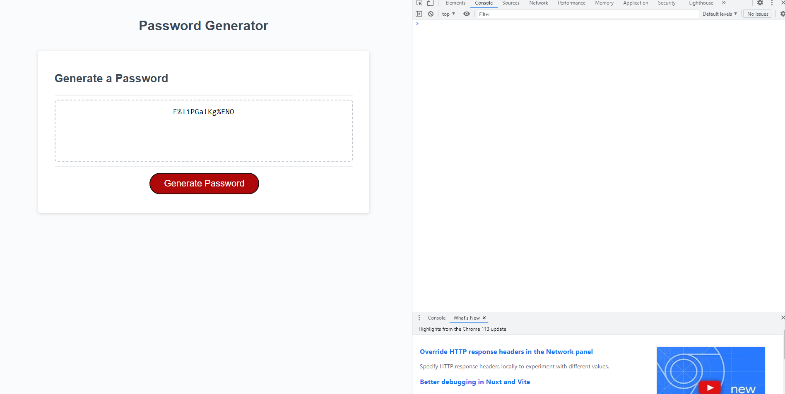

Repo contains a random password generator, that uses a combination of prompts and confirms to set parameters on the type of password that will be generated, from set character lists/strings.

Used tutoring hours and referenced some code from Stack Overflow(lines 47-50 in script.js file), which helped me create the function that generates random passwords, tutor helped me create if statements to help set parameters for the characters used within the random password.

